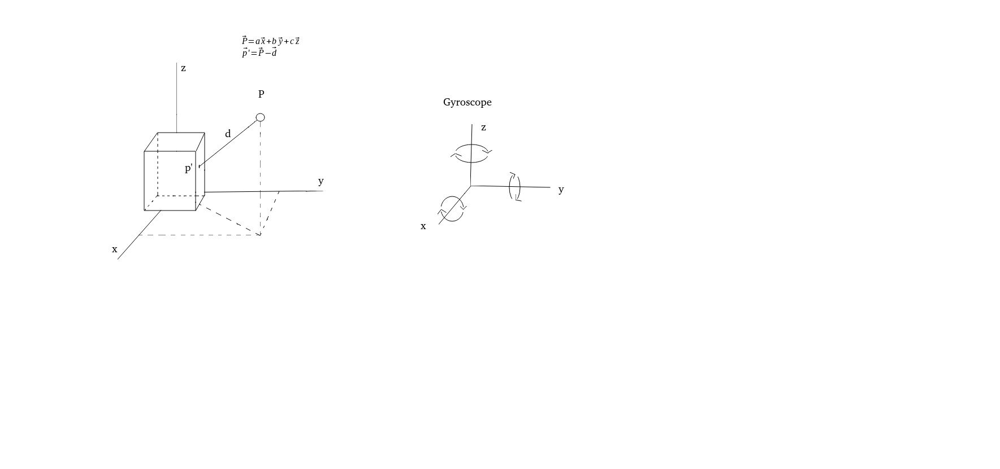

# 3D-Scanner

Cheap handheld 3d scanner with GY-85 module and VL53L0X sensor.

## Method

I'm using the IMU to track the scanner moving in the 3D, and the VL53L0X sensor to get the distance of the object relative to the device position.

## GY-85 Module

This is a nine degrees of freedom component with one accelerometer [(ADXL345)](https://www.analog.com/media/en/technical-documentation/data-sheets/ADXL345.pdf), one gyroscope [(ITG3200)](https://www.tinyosshop.com/datasheet/itg3205.pdf) and one magnetometer [(HMC5883L)](https://cdn-shop.adafruit.com/datasheets/HMC5883L_3-Axis_Digital_Compass_IC.pdf), this module uses the I2C interface to read from and write to each individual sensor. The I2C address of the accelerometer and the gyroscope is defined with a hardware connection on the board, with the addresses being the ones in the table below.

|Accelerometer|Gyroscope|Magnetometer|
|-------------|---------|------------|
|     0x53    |   0x69  |    0x1E    |

I wrote the code of three components, still in the making of putting all together in one class "GY_85".

## VL53L0X

### General

It can mesure distances up to 2 m in three diferent configurations, continuous timed, continuous and single measurement. With four ranging profiles, default mode, high speed, high accuracy and long range.

I used the code from [VL53L0X library for Linux](https://github.com/mjbogusz/vl53l0x-linux) and only modified the code to match with my i2c implementation.

### Timing and Communication

The typical timing budget for a range is 33 ms (initialization/ranging/processing). The data can be checked with pooling or interruption (Pin GPIO1), and the device communication interface is I2C.

|Range profile|Range timing budget|Typical performance|Typical application|
|-------------|-------------------|-------------------|-------------------|
|Default mode |       30 ms       |   1.2 m accuracy*  |    Standard      |
|High accuracy|      200 ms       |1.2 m accuracy < +/- 3%|Precise measurement|
|Long range   |       33 ms       |   2 m, accuracy * | Long ranging, only for dark conditions    |
|High speed   |       20 ms       |1.2 m, accuracy +/- 5%| Where accuracy is not important     |

* Note: see Table 12 in Datasheet for accuracy *.

### Power up

The XSHUT pin can be controled by the host to power off when not used, and then woken up through this pin.
The other mode is that the XSHUT pin is tied to VCC this way the device will never enter in hardware standby only in software standby (when measurement is stoped).
